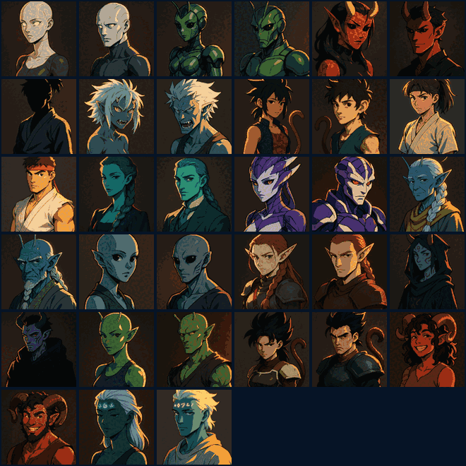

# DB Infinity Portrait

Your character, drawn from two sources because neither is enough alone.

`char.vitals` arrives over GMCP and is pushed, so the Lifeforce and Energy bars
stay honest while you fight. `score` carries race, sex, age, stats, armour,
kills and the rest, but only when you ask for it — so it's parsed once and kept.
Where the two overlap, GMCP wins, because `score` is a snapshot from whenever
you last typed it.

Nothing is gagged. The `score` block stays in your scroll exactly as the MUD
sent it.

## Two views

**Portrait** — the avatar, your first name, rank, race, sex and age, the two
bars, power level against base, zeni and alignment.

**Sheet** — behind the gear, everything `score` reports: stats, armour,
position, carry weight, the full kill and spar record, crits, tokens, session
gains and your EQ bonus.

## The avatar



Picked automatically from race and sex — all sixteen races, both sexes, plus a
generic silhouette for anything unrecognised. If there's no art for your race yet you
get a plain frame rather than a broken image, and you can always point it at
your own:

```
portrait avatar https://example.com/me.png
portrait avatar /home/you/Pictures/me.png
portrait avatar clear
```

**It has to be a URL, not a file on your disk.** A local file cannot be shown in
a widget by this client at all — its own helper converts a path to
`asset://localhost/...` rather than `file://`, and that protocol is not enabled
in the build, so there is no scheme the webview will fetch a local image over.
The File System Access permission does not change it, and neither does putting
the file in `~/MudForge/plugin-files`: that folder scopes `io.open`, which is a
different question.

Upload it anywhere that serves `https` — an image host, a gist, a repo — and use
that URL. It is how the bundled avatars load, and it follows you to another
machine rather than living on one disk.

The URL is checked rather than cleaned. It ends up inside a CSS `url()`, so
anything carrying a quote, a bracket, a backslash or a space is refused and the
previous avatar is kept.

## Commands

| command | does |
|---|---|
| `portrait` | the command list |
| `portrait show` / `portrait hide` | the panel |
| `portrait sheet` / `portrait portrait` | switch view without the gear |
| `portrait avatar <url or path>` / `clear` | your own image, or back to the race one |
| `portrait name <name>` / `clear` | correct the name, or back to what `score` says |
| `portrait opacity <0-100>` | `0` reads straight through it |
| `portrait diag` | what the plugin currently sees |

## Setup

None beyond what [Scouter](scouter.md) already needs. `Core.Supports.Add
["Map 1"]` turns on character stats as well as the map, so whichever of the two
plugins connects first does the handshake and the other stays quiet. Either
works installed on its own.

Portrait sends `score` once shortly after you log in, to fill the panel. After
that it reads whatever you type yourself.

## Getting the name right

The second line of `score` is `<first> <last> <title>` with nothing between
them — `Solao Bajiuik says no.` The first two capitalised words are the name and
the rest is your title. If that splits your name wrong, `portrait name <name>`
fixes it for good.

## Credits

A remake of the Portrait panel from [Solao's Aardwolf
plugins](https://github.com/SeanStoves/aardwolf-mudforge), rebuilt for
Dragonball Infinity's data. The shape is the same — an avatar picked from what
the MUD knows about your character, a compact portrait, and the full sheet a
click away — but everything under it is new: this MUD has no `char.base`, its
stats live in a fixed-format `score` block, and the vitals it pushes are a
different set.

The bundled avatars are AI-generated original artwork, not screencaps. They're
race archetypes in the style of the genre rather than any character's likeness.

MIT licensed.
