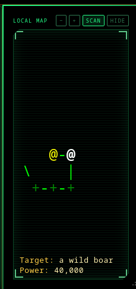

# DB Infinity Scouter



The local map as a scouter readout, driven by Dragonball Infinity's GMCP `Map`
module rather than by scraping the output.

Colours come from the server's own style table, so sectors, mobs, exits, doors
and your own position keep the meaning the MUD gave them — 51 styles, including
terrain by type and a separate colour for aggressive mobs.

- Fits itself to the panel, and re-fits when you resize it
- Follows your terminal's font and size rather than imposing its own
- Adjustable transparency, so it can sit over your main output and stay readable
- `scan <target>` puts the target and its power level under the map: steady for
  ten seconds, pulsing, then gone at thirty

## Set this up first

The MUD draws its map into the output stream **and** sends it over GMCP. The
panel uses the GMCP copy, so leaving both on means reading the same map twice:

```
config -supermap
config -autocompass
```

Scouter says so once on its own if it notices you haven't.

You don't need to enable GMCP anywhere. The server advertises only CHARSET and
never offers GMCP, so MudForge — correctly — never offers it either. Scouter
sends `Core.Hello` on connect, which is what gets the server talking. That's
also why this map works in Mudlet with no setup: Mudlet greets unprompted.

## Commands

| command | does |
|---|---|
| `dbmap` | the command list |
| `dbmap zoom fit` / `dbmap zoom <6-34>` | fill the panel, or lock a size |
| `dbmap opacity <0-100>` | `0` reads straight through it |
| `dbmap frame` | keep or drop the server's own map border |
| `dbmap gag` | keep the scouter's ASCII art out of the terminal |
| `dbmap header` | the title bar |
| `dbmap scan` | scanlines |
| `dbmap show` / `dbmap hide` | the panel |
| `dbmap redraw` | repaint now |
| `dbmap enable` / `dbmap hello` | ask the server for the Map module again |
| `dbmap diag` | what the plugin currently sees |
| `dbmap raw` / `dbmap packages` | the GMCP payloads, and every package held |
| `dbmap debug` | trace lines as they arrive |

The `-` and `+` buttons in the panel's bar lock a size; `dbmap zoom fit` hands
it back to the fitter.

## If the panel stays empty

`dbmap diag` answers most of it:

- `negotiated=false` with `attempts=8/8` — the server never answered. Check
  you're connected, then `dbmap hello`.
- `negotiated=true` but `cached definitions=0` — GMCP is up but the `Map`
  module isn't sending. `dbmap enable`.
- `source=none` with a definition cached — the snapshot hasn't arrived yet;
  move a room.

`lastError` carries anything the renderer threw.

## Credits

The `Map.Definition` / `Map.Snapshot` protocol is Penguin's, from the Mudlet
GMCPMap package.

Bo wrote the first MudForge implementation, which is where the parsing came
from — rejecting `NaN` from `tonumber`, treating a missing GMCP field as
`undefined` rather than `nil`, and copying every packet on arrival because the
client reuses the object once the callback returns. All three were found the
hard way and all three are still load-bearing.
